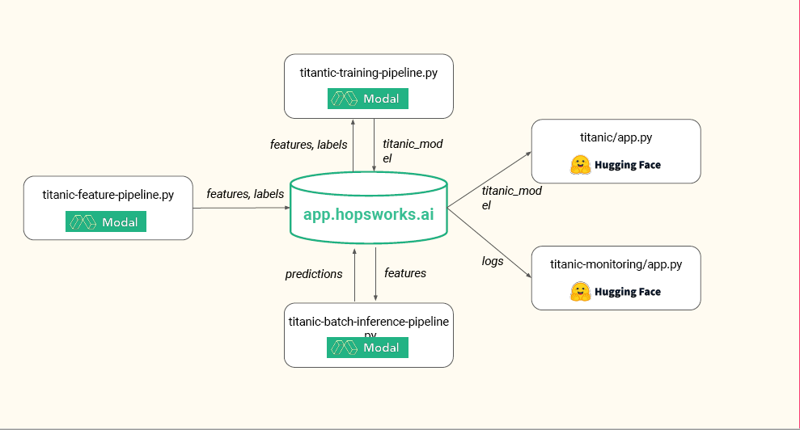

# ID2223 - Lab assignment 1
Teo Jansson Minne, Linnéa Fredriksson
## Iris flower, prediction and monitoring service
In the folder 'Iris' the source code for creating and deploying the Iris model can be found.
The UI can be accessed through the following Hugging Face spaces.
- Interactive
    - https://huggingface.co/spaces/TeoJM/iris
- Dashboard
    - https://huggingface.co/spaces/TeoJM/iris-monitor

The interactive application allows the user to insert values for sepal/petal width/length.
A simple model trained on the Iris dataset, [download link](https://repo.hops.works/master/hopsworks-tutorials/data/iris.csv "Iris dataset download link"), will then predict the flower species based on those values and present a sample image from that class.

A synthetic sample of data is generated once a day, the model does a prediction on this sample and the results are monitored and available in the dashboard.
## Titanic dataset, prediction and monitoring service
In the folder 'Titanic' the source code for creating and deploying the Titanic model can be found.
The UI can be accessed through the following Hugging Face spaces.
- Interactive
    - https://huggingface.co/spaces/TeoJM/Titanic
- Dashboard
    - https://huggingface.co/spaces/TeoJM/titanic-monitoring

This application functions in a very similar way to the Iris dataset one. The model is trained on the binary classification problem of predicting whether or not a Titanic passenger survived or not based on certain attributes.

The dataset was acccessed from, [access link](https://github.com/ID2223KTH/id2223kth.github.io/blob/master/assignments/lab1/titanic.csv "Titanic dataset"), and minor pre-processing steps were done. Binning of the ticket fares into 5 separate categories of price-range and numerical encoding for the other categorical features. Only the features with major predictive power were kept, namely: 
- Pclass
- Sex
- Age
- Sibling / Spouse
- Parch
- Price-range

A xgboost classifier was used with deafult parameter and a test set performance of 82% accuracy was achieved (80% training 20% testing split).
## Serverless approach
The pipelines of the models allow for a completely serverless approach to serving the Gradio application in Hugging face. This was achieved using [Modal](https://modal.com/) and [Hopsworks](https://www.hopsworks.ai/).

A summary of the structure:

Source : https://github.com/ID2223KTH/id2223kth.github.io/blob/master/assignments/lab1