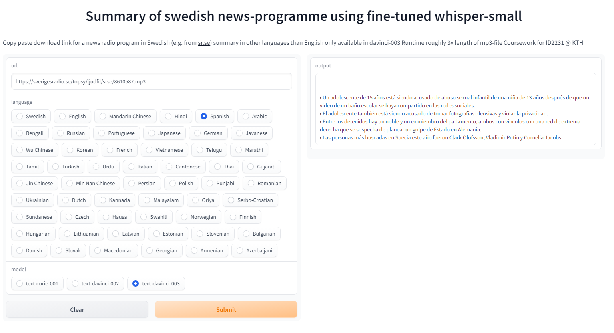
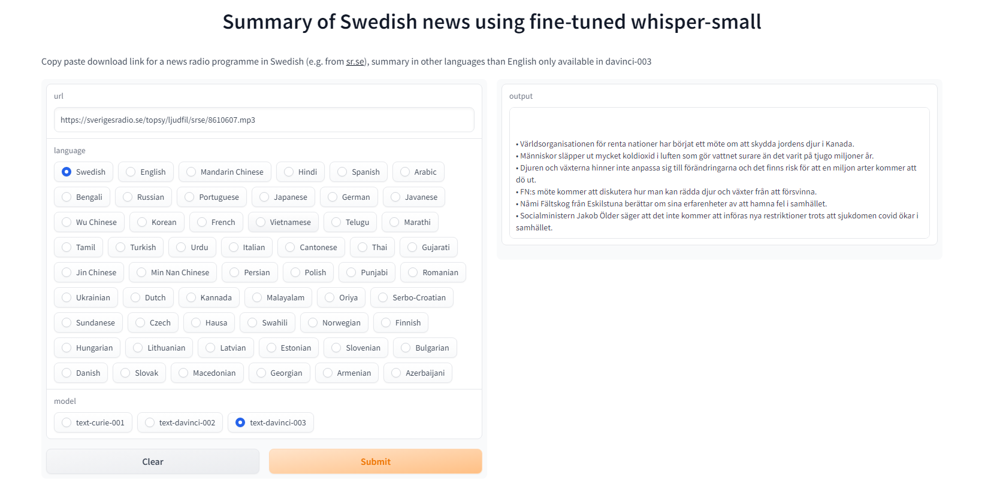

# ID2223 - Lab assignment 2
Teo Jansson Minne, Linnéa Fredriksson
## Whisper fine-tuning
The applications are reliant on OpenAI's [Whisper-small](https://huggingface.co/openai/whisper-small) model.

The pre-trained model was trained on Swedish auditory data from the Mozilla [Common Voice](https://huggingface.co/datasets/mozilla-foundation/common_voice_11_0) dataset.

The feature extraction pipeline can be found in "whisper_feature_extraction_pipeline.ipynb" where we have used a GCP bucket for storage of the processed dataset.
Accessing this data is then straightforward by simply authenticating ones Google account and directly retrieving the content of the bucket as seen in "whisper_training_pipeline.ipynb" where the training of the network is done.

The fine-tuned model and relevant parameters/metrics of the training [can be found here](https://huggingface.co/TeoJM/whisper-small-se), the word-error-rate on the Swedish dataset was improved significantly from 23.94 at beginning of training to 19.85 at the end of training.

## Application 1 - [Simple demo](https://huggingface.co/spaces/TeoJM/whisper-se-demo)
Use your microphone directly as input and receive a transcription from the Whisper model.

Source code found in "hugginface-spaces-base-demo".

## Application 2 - INSERT LINK HERE
Insert a Youtube link as input and receive a transcription from the Whisper model. Built using pytube library.

Source code found in "huggingface-spaces-youtube".

## Application 3 - [Multilingual Swedish news summarizer](https://huggingface.co/spaces/TeoJM/swedish-news-summarizer)
- Idea
  - Not everyone in a country can understand the language well enough to properly understand the content of a news programme, but every citizen should have access to important news.
  - Using our ASR model capable of transcribing a Swedish sound file, with a simple prompt, we can use a large language model to provide a summary in a given language. To this end we used the openai library to send request to [GPT-models](https://beta.openai.com/overview)
- Usage 
  - Insert a url linking directly to a .mp3 file on the web, recommended example would be from [Sveriges Radio](https://sverigesradio.se/p3nyheterpaenminut).
  - Choose the language you would like to receive the summary in (NOTE: Languages other than English only available using "text-davinci-003").
  - Choose the GPT model you'd like to perform the summary.

Source code found in "huggingface-spaces-radio-summary-demo"

Note that the Huggingface space is hosted on a basic cpu, inference times for longer episodes will therefore be very slow, either use short clips or duplicate the space and host it on a GPU for reasonable runtimes.

Example of summaries provided in different languages (not the same episode):

