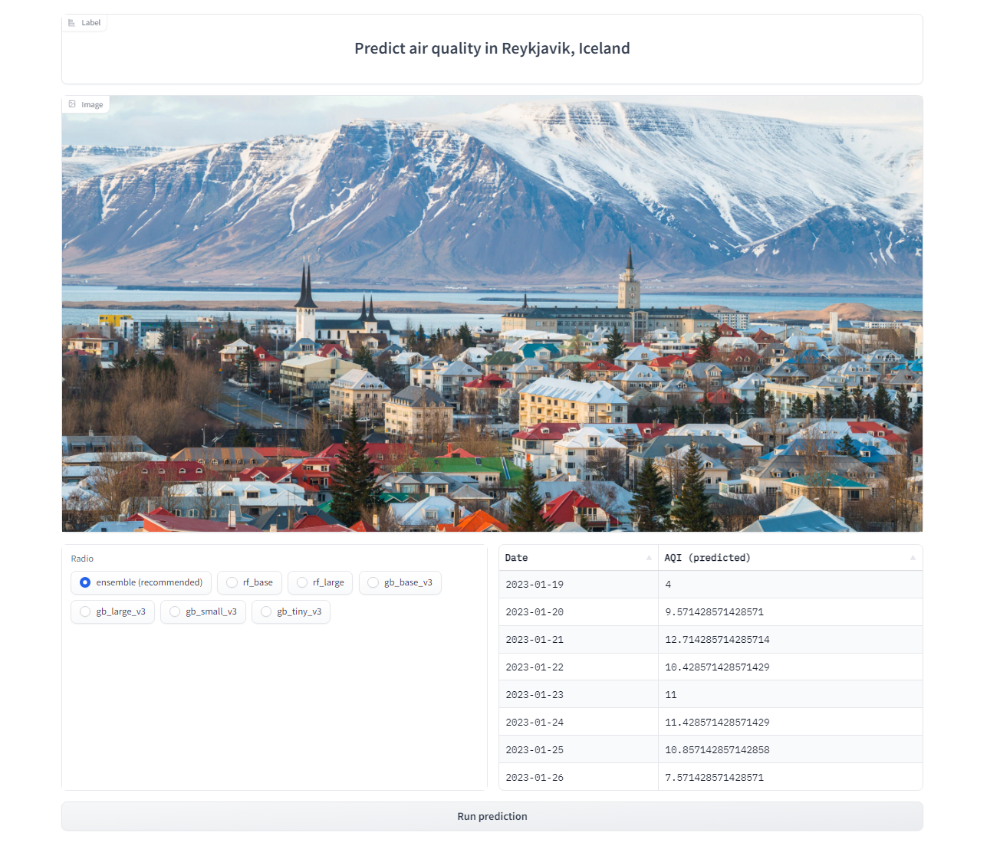
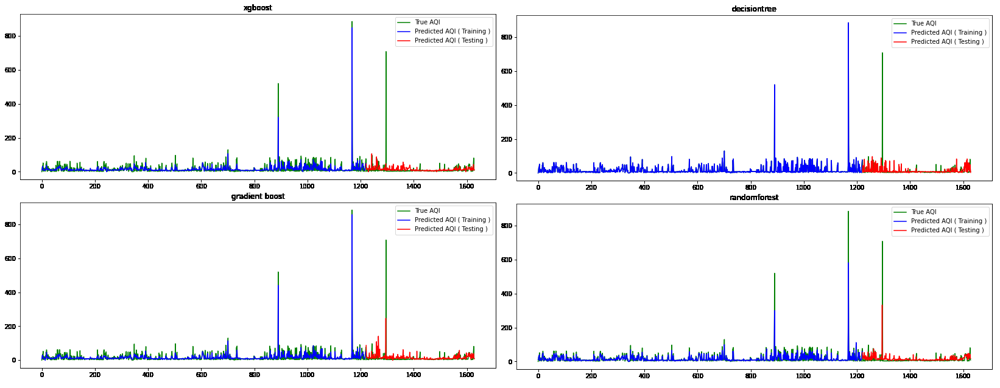
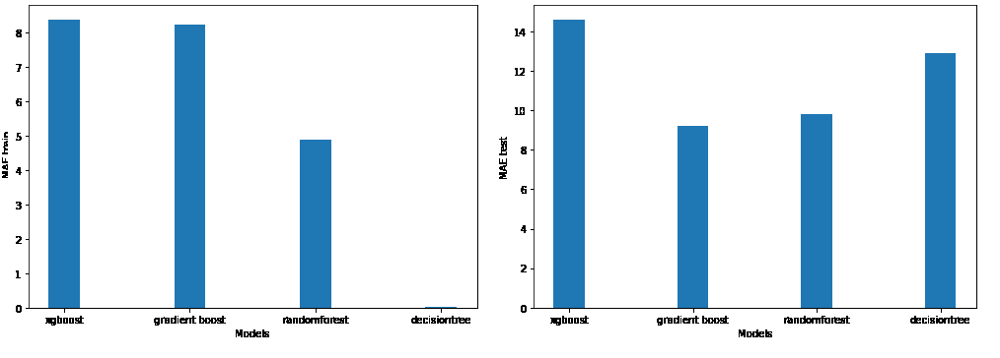

# ID2223 - Project : Air Quality Index forecasting service - Reykjavík
Teo Jansson Minne, Linnéa Fredriksson

## The service
This application forecasts the air quality in Reykjavik for the upcoming 7 days based on predictions from weather forecasting data. 
The project is based on the tutorial available at : https://github.com/logicalclocks/hopsworks-tutorials/tree/master/advanced_tutorials/air_quality

The application can be accessed in the [Hugging Face space](https://huggingface.co/spaces/TeoJM/id2223_project_air_quality_weekly_forecast_Reykjavik) and looks like this :

## The data
The historical air quality data was downloaded from [World Air Quality Index](https://aqicn.org/city/iceland/grensasv) from the site Grensásv in Reykjavik.
The data was parsed to the apropriate date-time format and the total AQI was calculated and added to the dataframe. 
The weather data which was downloaded from [VisualCrossing](https://www.visualcrossing.com) was cleaned, and unnecesary data for the task at hand was removed.
This was done in clean_data.ipynb. 

A feature group for [weather data](https://c.app.hopsworks.ai/p/5380/fs/5287/fg/14746) and [AQI data](https://c.app.hopsworks.ai/p/5380/fs/5287/fg/14745) were created and stored at Hopsworks using a simple backfill feature pipeline. 

## The model

In model_selection_training.ipynb the feature groups for the weather and AQI data were joined together to create a joint feature group to be able to perform model training. Four different models were trained for 1-day prediction using xgboost, gradient boosting, random forest and decision tree. 

In order to make the predictions, weather forecasting data for the next 7 days were downloaded directly from VisualCrossing into a data frame and fed into the model together with the current days AQI. Based on the weather forecasting, a prediction of the corresponding total AQI is made for the following week. 

Feature selection was done based on feature importance for the single day models, the variance of certain features were very low for the location and the models were overfit making this a important step, especially as the feature space dimensionality is essentially 7x:ed when data from an entire week is incorporated.

Based on performance, with mean absolute error on the test set being the main metric, 6 models were uploaded to the hopsworks model registry and are accessed in the app where forecasts can be made by any of the models or an ensemble method which simply averages their predictions.

## Performance

Single day prediction plots

Weekly forecast mean absolute error plots

